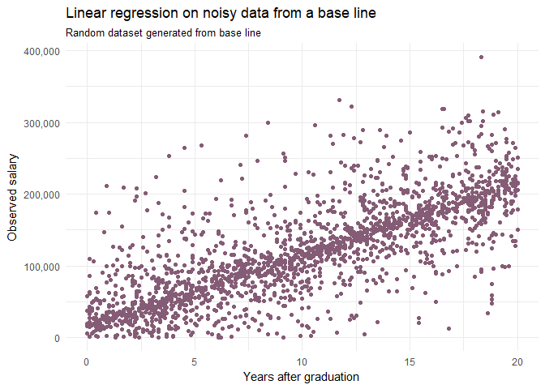
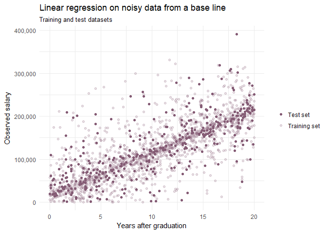
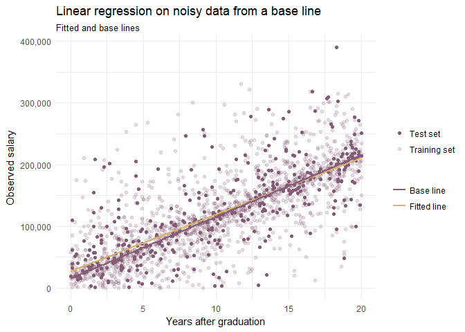
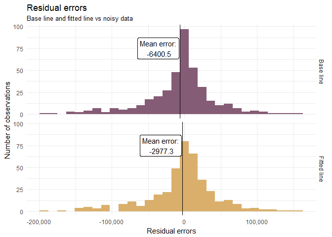

******
_This is a first text in a series of writings for an online course "Machine Learning A-Z™: Hands-On Python & R In Data Science". This text is generated using R Markdown. You can look at its source code on Github._

******

Nearly all of tutorials on linear regression I saw use a sample dataset and assume there is some relation between variables. What if instead we come up with a formula, generate a dataset, add a random noise and compare fitted line with a base line used to generate this dataset?

In other words, how linear regression line performes on a data with *known* parameters and with added random noise. 

******

Let's assume that base equation that shows relationship between salary and years in job market looks like this: 

$Salary = 10,000 * experience + 15,500$

I generated 2.000 numbers for experience, which is an independent variable:

 * uniform distribution, 
 * between 0 and 20 inclusive,
 * rounded to nearest decimal place.


```r
observations = 2000
experiences = round(runif(observations, 0, 20), digits = 1)
```

And finally I constructed a data frame with freshly generated years of experience, salary calculated using our base formula and noisy salary: base-formula salary with added random noise.

To calculate noise I multiplied two uniformly distributed variables. Both had mean 0, one had a large standard deviation (thousands) and nother has single-digit standard deviation. Salary with added noise is taken module if it is less than 0 and rounded to nearest hundred.


```r
dataset = data.frame(
  years_of_exp = experiences,
  salaries_true = salary(experiences),
  salaries_observed = abs(
    salary(experiences) + round(rnorm(observations, sd = 10000) * rnorm(observations, sd = 5), -2)
  )
)
```

First 10 rows of our generated dataset looks like this:


Table: Sample of dataset

 years_of_exp   salaries_true   salaries_observed
-------------  --------------  ------------------
         18.5         200,500             197,400
         10.7         122,500             119,900
          9.4         109,500             110,500
          5.8          73,500             105,100
         15.4         169,500             183,300
         15.5         170,500             169,100
          0.8          23,500              26,300
          8.7         102,500              75,000
          9.4         109,500             142,700
          5.5          70,500              66,900

Let's plot our noisy dataset.

<!-- -->

We see a clear linear pattern albeit with a substaitial noise around base line.

Our next step is to split our dataset into training a test sets. This is a standard machine learning technique: we will train our formula on training set, and will validate it on a separate subset ofour dataset.


```r
split = sample.split(dataset$salaries_observed, SplitRatio = .8)
training_set = subset(dataset, split == TRUE)
test_set = subset(dataset, split == FALSE)
```

Our test and training datasets look like this:

<!-- -->

We now can use a classic least squares algorithmon train dataset to calculate our fitted regression line. Then we compare predicted values on test dataset using our base formula and fitted formula with generated noisy data. 


```r
regressor = lm(salaries_observed ~ years_of_exp, data = training_set)
test_set$salaries_fitted = predict(regressor, newdata = test_set)
```


<!-- -->

Remarkably base line and fitted line are very close to each other. This is how they compare (two lines and generated points in test dataset):


Parameter | Base line | Fitted line |
----------|-----------|-------------|
Coefficients |$Salary = 10,000 * experience + 15,500$ | $Salary = 9195.652862 * experience + 27196.525798$
R-squared coefficient | 0.5381738 | 0.5523087|
Mean residual error | -6400.5 | -2977.3 |

And this is how residual errors for two lines look on a histogram: 

<!-- -->

By this time it is already clear that our fitted line is very close to a base line. R^2^ coefficient, mean residual error and error distribution -- all are very close to each other. 

Another interesting thing is that fitted line has slightly better accuracy. Median error is closer to 0 for a fitted line, R^2^ is slightly larger. If you remember, I took a module if a generated data point was negative. Fitted line picked this signal, making it more accurate than base line.

At the end it is remarkable that such rather simple and well-known technique from XIX century produces excellent results.
